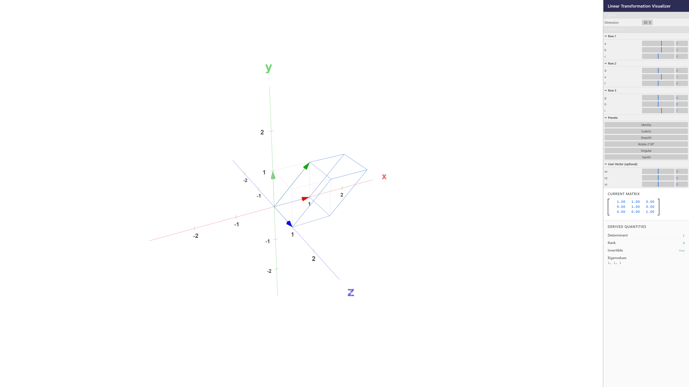

# Linear Transformation Visualizer

A browser-based interactive tool for visualising the geometric effect of linear transformations defined by user-supplied matrices. Inspired by tools like 3Blue1Brown's *Essence of Linear Algebra* series and Desmos. 

## Example image



## Features

- **2D mode** — orthographic view of the xy-plane
  - Original and transformed grid lines
  - Basis vectors e₁ (red) and e₂ (green) before and after transformation
  - Eigenvector lines (yellow) drawn automatically when real eigenvalues exist
  - Optional user vector (blue) and its image (cyan)

- **3D mode** — perspective view with full orbit controls
  - Original and transformed unit cube wireframe
  - Basis vectors e₁/e₂/e₃ before and after transformation
  - Eigenvector lines and user vector support as in 2D

- **Derived quantities panel** (updates live)
  - Determinant
  - Rank
  - Invertibility
  - Eigenvalues (real and complex)

- **Controls**
  - Sliders for every matrix entry (range −5 to 5, step 0.01)
  - Preset buttons for common transformations (identity, scale, shear, rotation, singular, …)
  - Optional user vector inputs
  - Smooth 500 ms animated transition when switching presets; instant update when dragging sliders

## Stack

| Concern | Library |
|---|---|
| Bundler | [Vite](https://vitejs.dev/) |
| Language | TypeScript (strict) |
| 3D rendering | [Three.js](https://threejs.org/) |
| Controls UI | [lil-gui](https://lil-gui.georgealways.com/) |

No framework (React/Vue/etc.) — plain TypeScript modules only. Runs entirely in the browser with no backend.

## Getting started

```bash
npm install
npm run dev        # dev server → http://localhost:5173
npm run build      # production build → dist/
npm run preview    # serve the production build locally
```

## Project structure

```
3d-desmos/
├── index.html          # two-panel layout (canvas + controls)
├── initial_prompt.md   # initial prompt for Claude Code
├── package.json
├── tsconfig.json
├── vite.config.ts
└── src/
    ├── main.ts         # entry point — GUI, mode toggle, animation loop
    ├── math.ts         # matrix math (det, rank, eigenvalues, lerp)
    ├── visualizer2d.ts # 2D Three.js scene (OrthographicCamera)
    └── visualizer3d.ts # 3D Three.js scene (PerspectiveCamera + OrbitControls)
```

## Implementation notes

### `src/math.ts`

Pure functions, no side-effects.

- `det2` / `det3` — direct cofactor expansion
- `rank2` / `rank3` — Gaussian elimination with partial pivoting
- `eigenvalues2` — characteristic polynomial solved via quadratic formula; returns real and complex pairs
- `eigenvalues3` — cubic characteristic polynomial; Cardano's formula with the trigonometric method for three real roots (casus irreducibilis)
- `eigenvector2` / `eigenvector3` — null-space of `(A − λI)` via row cross-products
- `lerpMatrix` — component-wise linear interpolation for animation
- `applyMatrix2` / `applyMatrix3` — multiply column vector by row-major matrix

### `src/visualizer2d.ts`

- `OrthographicCamera` fixed top-down at z = 10
- Grid lines rebuilt each frame only when the matrix changes (not every tick)
- Basis vectors and eigenvectors use `THREE.ArrowHelper`
- `update(matrix, animate)` — `animate=false` is instant; `animate=true` triggers a 500 ms ease-in-out-quad lerp from the previous matrix state

### `src/visualizer3d.ts`

- `PerspectiveCamera` + `OrbitControls` with damping
- Unit cube edges enumerated explicitly; corner positions recomputed via `applyMatrix3` on each update
- Same animation system as 2D

### `src/main.ts`

- `buildModeGui()` — prepends a lil-gui panel for the 2D/3D toggle
- `build2dGui()` / `build3dGui()` — builds (or rebuilds) the matrix-entry GUI; `onChange` → instant, `onFinishChange` → animated
- `switchTo(mode)` — tears down the active visualizer and renderer, instantiates the new one, rebuilds GUI
- Single `requestAnimationFrame` loop calls `viz.tick(now)` on whichever visualizer is active

## Keyboard / mouse controls (3D mode)

| Action | Control |
|---|---|
| Orbit | Left-click + drag |
| Pan | Right-click + drag |
| Zoom | Scroll wheel |
| Reset view | — (refresh page) |
