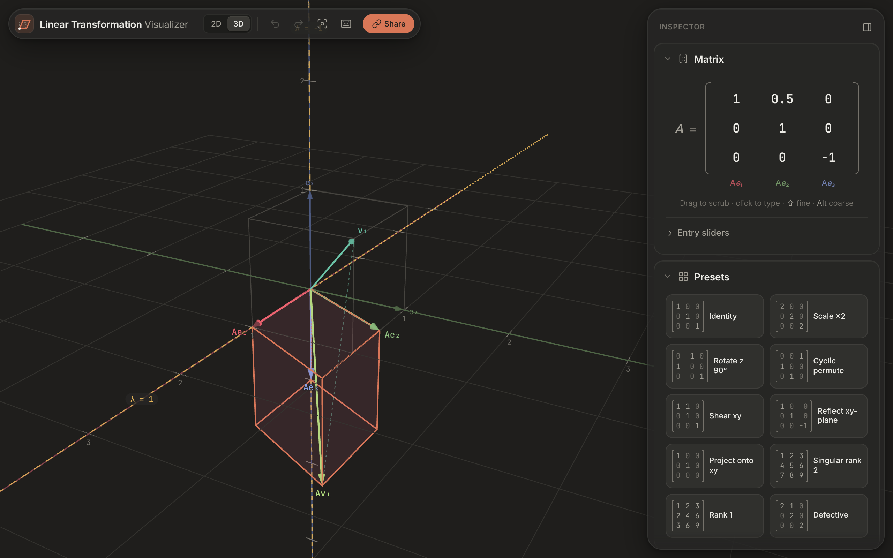

# Linear Transformation Visualizer

An interactive, browser-based tool for seeing what a matrix _does_. Edit a 2×2 or 3×3 matrix and
watch its action on the plane or on space in real time: the grid, the basis vectors, the signed
area or volume, the eigenspaces, and your own vectors. Inspired by 3Blue1Brown's _Essence of Linear
Algebra_ and by Desmos.

Runs entirely in your browser: no backend, no network requests.

![2D view: A = [[2, 1], [1, 2]] with eigenlines λ = 3 and λ = 1, the image of the unit square, and a vector v ↦ Av](docs/images/screenshot-2d.png)



## Features

- **2D and 3D views.** The 2D view uses an orthographic camera with pan and zoom. The 3D view uses
  a perspective camera, z-up, with orbit controls.
- **What is drawn:** the original and transformed grid (2D) or unit cube (3D); the basis vectors
  e₁, e₂, e₃ and their images Aeᵢ; the image of the unit square or cube, shaded by the sign of
  det A; the real eigenspaces (lines, and planes in 3D, labelled with λ); and any number of your
  own vectors v with their images Av.
- **Analysis panel**, updated live:
  - det A (with orientation preserved, reversed or collapsed) and tr A
  - rank and nullity (rank–nullity)
  - eigenvalues, including complex pairs, with **algebraic and geometric multiplicity**; defective
    matrices are flagged
  - orthonormal bases of every eigenspace, of ker A and of im A
- **Editing.** Drag a matrix cell to scrub it (⇧ for fine steps, Alt for coarse), click to type
  (fractions like `-3/4` are accepted), or use the arrow keys or the per-entry sliders. Presets
  cover rotations, shears, reflections, projections, singular, defective and complex-eigenvalue
  cases.
- **Animation.** Typed values and presets tween smoothly, while dragging updates instantly.
  Choose **Linear** interpolation (every point moves in a straight line, as in 3Blue1Brown's
  videos) or **Polar** (rotations animate as rotations: A = R·S, slerp R, lerp S).
- **Undo/redo**, **share links** (the whole scene is encoded in the URL), and autosave.
- **Layers panel** to toggle what is drawn. Works on phones (the inspector becomes a bottom sheet).

### Keyboard shortcuts

| Action                  | Keys                            |
| ----------------------- | ------------------------------- |
| Undo / redo             | ⌘/Ctrl + Z, ⇧ + ⌘/Ctrl + Z      |
| Switch to 2D / 3D       | `2` / `3`                       |
| Reset camera            | `R`                             |
| Show all shortcuts      | `?`                             |
| Pan / zoom (2D)         | drag / scroll                   |
| Orbit / pan / zoom (3D) | left-drag / right-drag / scroll |

## Getting started

```bash
npm install
npm run dev        # dev server → http://localhost:5173
npm run build      # type-check + production build → dist/
npm run preview    # serve the production build
```

Dev-only pages:

- `/dev/engine.html`: a renderer playground without the UI (presets, a drag stress test,
  leak counters)
- `/?fixtures`: a gallery of the Analysis panel on edge cases

## Quality

```bash
npm run check      # svelte-check + TypeScript (strict)
npm run lint       # ESLint (incl. architecture boundaries) + Prettier
npm test           # Vitest: math core, store, persistence, engine units
npm run test:e2e   # Playwright: end-to-end, persistence and performance checks
```

The math core is tested by **invariants**, not by restating the implementation:

- ‖Av − λv‖ ≈ 0, Σλ = tr A and Πλ = det A
- orthonormal bases, and rank + nullity = n
- hundreds of seeded random matrices, plus exact integer cross-checks of the multiplicities

## Stack

| Concern          | Choice                                           |
| ---------------- | ------------------------------------------------ |
| Build            | Vite + TypeScript (strict)                       |
| UI               | Svelte 5 (runes)                                 |
| Rendering        | Three.js: fat lines, CSS2D labels, OrbitControls |
| Math typesetting | KaTeX                                            |
| Fonts            | Inter, JetBrains Mono (bundled, offline)         |
| Tests            | Vitest, Playwright                               |

## Architecture

```
src/core/     pure math: m×n matrices, LU, RREF, eigen, polar, analysis, formatting
src/state/    scene document (plain JSON), store, presets, persistence, undo
src/engine/   Three.js: one renderer, camera rigs, animator, pluggable layers
src/ui/       Svelte: design system, layout, registry-driven panels
```

Dependencies point one way: `ui → state → core` and `engine → core`. ESLint enforces this.
The store talks to the engine only through a typed event stream. Linear maps are applied **on the
GPU** (the matrix is the object transform), so editing costs O(1) CPU regardless of grid density,
and the renderer only draws when something changes.

The code is built to be extended: presets, layers, scene-object kinds, sidebar panels,
decompositions, sequences of maps and non-square maps all have explicit extension points. See
**[docs/ARCHITECTURE.md](docs/ARCHITECTURE.md)** for recipes, and [CLAUDE.md](CLAUDE.md) for
contributor conventions.
